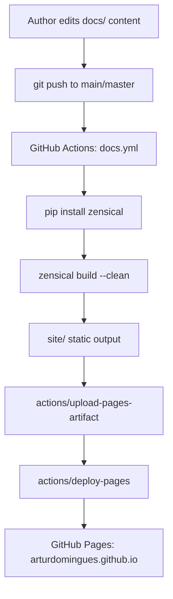

# AI Docs — Repository Index

## What This Repo Does

This is a personal academic website for Artur Domingues, a physicist specializing in quantum control of solid-state spin systems (NV centers in diamond), optimal control theory, and machine learning for quantum technologies. The site is a single-page static site built with **Zensical** (a static site generator compatible with MkDocs) and automatically deployed to GitHub Pages on every push to `main`/`master`. It serves as a professional landing page displaying biography, research works, and contact details.

## Stack & Runtime

| Layer | Technology |
|---|---|
| Language | Python 3.12 |
| Static Site Generator | [Zensical](https://zensical.org) (MkDocs-compatible) |
| Package Manager | [uv](https://github.com/astral-sh/uv) |
| Theme | Material for MkDocs (via Zensical) with custom Tokyo Night palette |
| Math Rendering | MathJax 3 (via CDN) |
| Markdown Extensions | PyMdown Extensions (superfences, highlight, arithmatex, emoji, etc.) |
| Hosting | GitHub Pages |
| CI/CD | GitHub Actions |

## Architecture Overview



## Folder Map

```
.
├── .ai-docs/               ← AI Agent Knowledge Directory (this directory)
│   ├── _INDEX.md           ← Master entry point (you are here)
│   ├── WORKFLOWS.md        ← End-to-end build/deploy workflow documentation
│   ├── AGENTS.md           ← Guide for AI agents working on this repo
│   └── files/              ← Per-file documentation mirroring repo structure
├── .github/
│   └── workflows/
│       └── docs.yml        ← CI/CD pipeline: build + deploy to GitHub Pages
├── docs/                   ← Content root (all site pages live here)
│   ├── index.md            ← Homepage / sole page of the site
│   ├── javascripts/
│   │   └── mathjax.js      ← MathJax 3 initialization & MkDocs integration
│   └── stylesheets/
│       └── tokyo-night.css ← Custom Tokyo Night light & dark color schemes
├── .gitignore              ← Ignores site/, .cache/, .venv/, uv.lock, vendor/
├── .python-version         ← Pins Python 3.12 for uv/pyenv
├── LICENSE                 ← Repository license
├── README.md               ← Maintainer guide (local dev, config, deployment)
├── mkdocs.yml              ← Zensical/MkDocs site configuration
└── pyproject.toml          ← Python project metadata & Zensical dependency
```

## Key Entry Points

| File | Why Read It First |
|---|---|
| [`mkdocs.yml`](../mkdocs.yml) | Controls everything about the site: nav, theme, extensions, extra CSS/JS |
| [`docs/index.md`](../docs/index.md) | The sole content page — the entire website |
| [`.github/workflows/docs.yml`](../.github/workflows/docs.yml) | Defines the automated build and deploy pipeline |
| [`docs/stylesheets/tokyo-night.css`](../docs/stylesheets/tokyo-night.css) | Custom theme — understand before touching visual styling |
| [`pyproject.toml`](../pyproject.toml) | Python dependencies (just `zensical`) |

## Environment & Setup

```bash
# Prerequisites: Python 3.12+, uv installed

# 1. Install dependencies into a virtual environment
uv sync          # reads pyproject.toml and installs zensical into .venv/

# 2. Live preview with hot-reload
uv run zensical serve

# 3. Production build (writes to site/)
uv run zensical build --clean

# 4. The site is served at http://127.0.0.1:8000 during local development
```

**No required environment variables.** The project has no `.env` file or secrets — everything is static content.

## Conventions & Patterns

- **Single-page site**: all content lives in `docs/index.md`. Adding new pages means adding `.md` files to `docs/` and updating the `nav` section in `mkdocs.yml`.
- **Custom CSS**: new stylesheets go in `docs/stylesheets/` and must be registered under `extra_css` in `mkdocs.yml`.
- **Custom JS**: new scripts go in `docs/javascripts/` and must be registered under `extra_javascript` in `mkdocs.yml`.
- **Theme palettes**: both `tokyo-night-light` and `tokyo-night-dark` schemes are defined in `tokyo-night.css`; CSS variables are prefixed `--tnl-*` (light) and `--tnd-*` (dark).
- **Math**: inline math uses `\( ... \)`, display math uses `\[ ... \]`. MathJax is re-triggered on every page navigation via `document$.subscribe()` (MkDocs SPA pattern).
- **No linting/testing infrastructure**: this is a pure static site; there are no Python tests, no JS tests, no linting commands beyond the Zensical build itself.
- **Deployment**: automated — every push to `main` or `master` triggers the GitHub Actions workflow.

## Files Index

| File | Purpose | Links to |
|---|---|---|
| [`mkdocs.yml`](../mkdocs.yml) | Site configuration: nav, theme, extensions, CSS/JS | [mkdocs.yml.md](files/mkdocs.yml.md) |
| [`pyproject.toml`](../pyproject.toml) | Python project metadata; declares `zensical` dependency | [pyproject.toml.md](files/pyproject.toml.md) |
| [`docs/index.md`](../docs/index.md) | Homepage content: bio, works, contact | [docs/index.md.md](files/docs/index.md.md) |
| [`docs/javascripts/mathjax.js`](../docs/javascripts/mathjax.js) | MathJax 3 config & MkDocs SPA re-trigger hook | [docs/javascripts/mathjax.js.md](files/docs/javascripts/mathjax.js.md) |
| [`docs/stylesheets/tokyo-night.css`](../docs/stylesheets/tokyo-night.css) | Custom Tokyo Night light & dark CSS color schemes | [docs/stylesheets/tokyo-night.css.md](files/docs/stylesheets/tokyo-night.css.md) |
| [`.github/workflows/docs.yml`](../.github/workflows/docs.yml) | GitHub Actions CI/CD: build & deploy to Pages | [.github/workflows/docs.yml.md](files/.github/workflows/docs.yml.md) |
| [`README.md`](../README.md) | Maintainer guide: setup, config, deployment notes | [README.md.md](files/README.md.md) |
| [`.gitignore`](../.gitignore) | Ignores build artifacts, venv, lock file | [.gitignore.md](files/.gitignore.md) |
| [`.python-version`](../.python-version) | Pins Python version to 3.12 for uv/pyenv | [.python-version.md](files/.python-version.md) |
| [`LICENSE`](../LICENSE) | Repository license | — |
