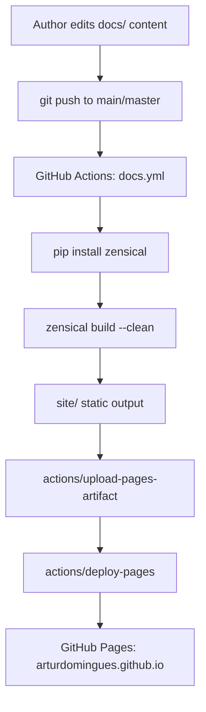

# AGENTS.md

## What This Repo Does

Personal academic website for Artur Domingues, a physicist specializing in quantum control of solid-state spin systems (NV centers in diamond), optimal control theory, and machine learning for quantum technologies. It is a single-page static site built with **Zensical** (a MkDocs-compatible static site generator) and automatically deployed to GitHub Pages on every push to `main`/`master`. The site serves as a professional landing page displaying biography, research works, and contact details.

## Stack

| Layer | Technology |
|---|---|
| Language | Python 3.12 (local, pinned via `.python-version`) / `3.x` latest (CI) |
| Static Site Generator | Zensical (MkDocs-compatible) |
| Package Manager | uv |
| Theme | Material for MkDocs (via Zensical) with custom Tokyo Night palette |
| Math Rendering | MathJax 3 (via CDN: `unpkg.com/mathjax@3`) |
| Markdown Extensions | PyMdown Extensions (superfences, arithmatex, highlight, emoji, etc.) |
| Hosting | GitHub Pages |
| CI/CD | GitHub Actions |

## Folder Structure

```
.
├── .ai-docs/               ← AI Agent Knowledge Directory (per-file docs, workflows, index)
│   ├── _INDEX.md           ← Master entry point and architecture overview
│   ├── WORKFLOWS.md        ← End-to-end file chains for every major operation
│   ├── AGENTS.md           ← Extended agent rulebook (verbose — read for deep guidance)
│   └── files/              ← Per-file documentation mirroring repo source structure
├── .github/
│   └── workflows/
│       └── docs.yml        ← CI/CD pipeline: build + deploy to GitHub Pages
├── docs/                   ← Content root (all site pages live here)
│   ├── index.md            ← Homepage / sole content page of the site
│   ├── javascripts/
│   │   └── mathjax.js      ← MathJax 3 initialization & MkDocs SPA re-trigger hook
│   └── stylesheets/
│       └── tokyo-night.css ← Custom Tokyo Night light & dark color schemes (~500 lines)
├── .gitignore              ← Ignores site/, .cache/, .venv/, uv.lock, vendor/
├── .python-version         ← Pins Python 3.12 for uv/pyenv
├── LICENSE                 ← Repository license
├── README.md               ← Maintainer guide (local dev, config, deployment)
├── mkdocs.yml              ← Zensical/MkDocs site configuration (nav, theme, extensions, assets)
└── pyproject.toml          ← Python project metadata & Zensical dependency
```

## Key Files

| File | What it does |
|---|---|
| `mkdocs.yml` | Controls the entire site build: nav, theme, palette, Markdown extensions, extra CSS/JS, URL strategy |
| `docs/index.md` | The sole content page — bio, research works, contact, disclaimer |
| `.github/workflows/docs.yml` | GitHub Actions CI/CD: installs Zensical, builds site, deploys to GitHub Pages |
| `docs/stylesheets/tokyo-night.css` | Custom Tokyo Night light & dark CSS palette (~500 lines, CSS custom properties `--tnl-*` / `--tnd-*`) |
| `docs/javascripts/mathjax.js` | Pre-configures MathJax 3 and re-triggers typesetting on every SPA page navigation |
| `pyproject.toml` | Declares `zensical` as the sole Python dependency; used by `uv` locally |
| `.python-version` | Pins Python 3.12 for `uv` and `pyenv` |
| `README.md` | Maintainer guide: setup, configuration, deployment notes |
| `.gitignore` | Excludes `site/`, `.venv/`, `uv.lock`, `.cache/`, `vendor/` from version control |
| `LICENSE` | Repository license |

## How to Run Locally

```bash
# Prerequisites: Python 3.12+, uv installed

# 1. Install dependencies
uv sync

# 2. Live preview with hot-reload at http://127.0.0.1:8000
uv run zensical serve

# 3. Production build (writes to site/)
uv run zensical build --clean
```

No environment variables required — the project has no secrets or `.env` file.

## How to Run Tests

This repository has **no automated tests**. The only validation is the build itself:

```bash
# Validate the site builds without errors (exit 0 = valid)
uv run zensical build --clean

# Visual validation — inspect in browser
uv run zensical serve
```

No test files exist. Do not create test infrastructure — this project does not need it.

## Architecture & Data Flow



## Core Workflows

### Local Development & Content Authoring
1. `pyproject.toml` — defines `zensical` dependency; `uv sync` installs it
2. `.python-version` — `uv` reads this to select Python 3.12
3. `docs/index.md` — author edits Markdown content
4. `mkdocs.yml` — Zensical reads nav, extensions, theme, extra assets
5. `docs/stylesheets/tokyo-night.css` — loaded as `extra_css`
6. `docs/javascripts/mathjax.js` — loaded as `extra_javascript`, configures MathJax
7. `uv run zensical serve` → hot-reload dev server at `http://127.0.0.1:8000`

### Automated Build & Deploy (CI/CD)
1. `.github/workflows/docs.yml` — triggered on push to `main`/`master`
2. `actions/configure-pages@v5` → `actions/checkout@v5` → `actions/setup-python@v5`
3. `pip install zensical` — installs Zensical in CI
4. `mkdocs.yml` — consumed by `zensical build --clean`
5. `docs/index.md` → compiled to `site/index.html`
6. `docs/stylesheets/tokyo-night.css` + `docs/javascripts/mathjax.js` → bundled into `site/`
7. `actions/upload-pages-artifact@v4` → `actions/deploy-pages@v4`
8. Live site updated at `https://arturdomingues.github.io`

### Adding a New Content Page
1. Create `docs/<new-page>.md`
2. Add to `mkdocs.yml` `nav`: `- Title: new-page.md`
3. Optionally link from `docs/index.md`
4. `uv run zensical serve` to verify, then `git push`

### Adding or Modifying Visual Styles
1. Edit `docs/stylesheets/tokyo-night.css` (CSS custom properties `--tnl-*` light, `--tnd-*` dark)
2. If adding a *new* CSS file: register under `extra_css` in `mkdocs.yml`
3. `uv run zensical serve` to verify in both light and dark mode

## Conventions

- **Single-page site**: all content is in `docs/index.md`; new pages require a `nav` entry in `mkdocs.yml`
- **CSS custom properties**: light scheme uses `--tnl-*` prefix, dark scheme uses `--tnd-*` prefix; always update **both** scheme blocks together
- **New CSS files**: go in `docs/stylesheets/` and must be registered under `extra_css` in `mkdocs.yml`
- **New JS files**: go in `docs/javascripts/` and must be registered under `extra_javascript` in `mkdocs.yml` — **load order matters** (config scripts before CDN scripts)
- **Math**: inline `\( ... \)`, display `\[ ... \]`; MathJax is already configured, no extra setup needed
- **Mermaid diagrams**: use ` ```mermaid ` fenced blocks — already configured in `mkdocs.yml`
- **URL strategy**: `use_directory_urls: false` — all URLs are flat `.html` files (no trailing slashes)
- **Python env**: always use `uv run <command>` for local execution; Python 3.12 is pinned
- **Deployment**: every push to `main`/`master` deploys automatically — ensure changes are production-ready before pushing
- **Never commit**: `site/`, `.venv/`, `uv.lock` (all gitignored)

## ⚠️ Gotchas & Risky Zones

| File / Area | Risk |
|---|---|
| `mkdocs.yml` | Central build config — YAML syntax errors stop the entire build; nav entries must match existing files exactly |
| `docs/javascripts/mathjax.js` load order | `mathjax.js` **must** appear before the CDN URL in `extra_javascript`; reversing the order breaks math rendering |
| `tokyo-night.css` scheme names | Scheme names `tokyo-night-light` / `tokyo-night-dark` must exactly match the `scheme:` values in `mkdocs.yml` `palette`; renaming either silently breaks the theme |
| `.github/workflows/docs.yml` | Unpinned: `pip install zensical` and `python-version: 3.x` — a breaking upstream release can fail the build without any local code change |
| `pyproject.toml` `requires-python` | Changing the Python version must be coordinated with `.python-version` (local, pins 3.12) and CI (`docs.yml` uses `python-version: 3.x` — latest Python 3, not pinned to 3.12) |
| `pymdownx.superfences` in `mkdocs.yml` | Appears **twice** in the extensions list (once with Mermaid config, once plain) — duplicate is harmless but confusing; last entry wins for options |
| `ignoreHtmlClass: ".*|"` in `mathjax.js` | Looks like a bug but is intentional — the regex `.*\|` matches any string (any chars OR empty), so MathJax ignores all elements by default; only `arithmatex`-marked elements (via `processHtmlClass`) are processed |
| Legacy `.gitignore` entries | Contains leftover ActionScript/Flash entries (`.swf`, `.air`, `bin-debug/`, etc.) — harmless but confusing |

## What NOT to Do

- **Do not commit `site/`** — it is generated build output and gitignored; committing it bloats the repo and interferes with CI (see `.gitignore.md`)
- **Do not add a new page without updating `mkdocs.yml` `nav`** — the page builds but is unreachable; `zensical build` does not warn about orphaned pages (see `mkdocs.yml.md`)
- **Do not register a new JS file after the CDN script it configures** — e.g., adding a config script after `https://unpkg.com/mathjax@3/...` will fail because the CDN library initializes before the config is set (see `docs/javascripts/mathjax.js.md`)
- **Do not change only one palette scheme** — editing only `tokyo-night-light` or only `tokyo-night-dark` creates visual inconsistency in the other mode (see `docs/stylesheets/tokyo-night.css.md`)
- **Do not pin `zensical` to a specific version** unless explicitly asked — the project intentionally floats to the latest (see `pyproject.toml.md` and `.github/workflows/docs.yml.md`)

## Keeping Docs in Sync

After completing any task, if you created, deleted, or significantly changed a file:
1. Update its `/.ai-docs/files/` counterpart to reflect the change
2. Update the `## Key Files` table in this file if the file's purpose changed
3. Update `/.ai-docs/WORKFLOWS.md` if the change affected a workflow's file chain
4. Update `/.ai-docs/_INDEX.md` Files Index table if a file was added or removed

Do not rewrite docs for files you did not touch. Do not leave docs stale.
If a change is too large to document fully, flag it with ⚠️ and a short note so a human supervisor knows what needs attention.

## Deep Docs

This repo has per-file documentation in `/.ai-docs/files/` mirroring the source structure.
Path mapping: `mkdocs.yml` → `/.ai-docs/files/mkdocs.yml.md`

Each file doc contains: purpose, exports, internal logic, side effects, env vars used, how to modify safely, gotchas, and Obsidian-style `[[linked files]]`.

**When to use them:**
- This `AGENTS.md` is enough for most tasks — start here
- Before editing any non-trivial file, read its `/.ai-docs/files/` counterpart first
- For tasks spanning multiple files, check `/.ai-docs/WORKFLOWS.md` for the full file chain

**Other deep doc entry points:**
- `/.ai-docs/_INDEX.md` — master index with full files table and architecture overview
- `/.ai-docs/WORKFLOWS.md` — end-to-end file chains for every major operation
- `/.ai-docs/AGENTS.md` — extended agent rulebook with safe zones and test guidance
